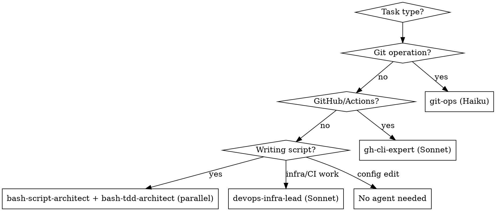

# Dotfiles Development

## Symlink Architecture

```
~/.dotfiles -> <repo>               # Primary anchor (points to repo root)
~/.zshrc                            # Bootstrap file (sources ~/.dotfiles/zshrc)
~/.ssh/config -> ~/.dotfiles/ssh/config
~/.config/nvim -> ~/.dotfiles/nvim
~/.claudescripts -> ~/.dotfiles/claudescripts
```

All paths resolve through `~/.dotfiles`. Scripts find the repo via:
```bash
DOTFILES_DIR="$(readlink -f "$HOME/.dotfiles")"
```

## Agent Selection



| Agent | Model | Use For |
|-------|-------|---------|
| `git-ops` | Haiku | **All git operations** - commits, branches, status. Isolates git context from main conversation. |
| `bash-script-architect` | Haiku | Writing/debugging bash scripts |
| `bash-tdd-architect` | inherit | TDD for bash scripts - runs **IN PARALLEL** with `bash-script-architect` |
| `gh-cli-expert` | Sonnet | GitHub Actions failures, PR management, gh CLI |
| `devops-infra-lead` | Sonnet | Infrastructure, CI/CD, system admin |

**Important:** For committing changes, use the `git-ops` agent (not generic skills). It keeps git output isolated from the main context window.

**TDD for Scripts:** When writing or modifying bash scripts, launch `bash-tdd-architect` **IN PARALLEL** with `bash-script-architect`. The TDD agent designs behavior-driven tests BEFORE seeing implementation, ensuring true test-first development.

## Dependencies

Install via Homebrew on macOS:

| Tool | Install | Purpose |
|------|---------|---------|
| `bats-core` | `brew install bats-core` | Bash Automated Testing System |
| `yq` | `brew install yq` | YAML query tool (used by `actions-fails`) |
| `jq` | `brew install jq` | JSON processor |
| `gh` | `brew install gh` | GitHub CLI |

## Wrapper Scripts (claudescripts/)

| Script | Model | Purpose |
|--------|-------|---------|
| `push` | Haiku | Quick commit/push with conventional commits |
| `ghcli` | Sonnet | GitHub CLI operations |
| `support` | Opus | Bash debugging with web search |
| `actions-fails` | N/A | Check workspace repos for GitHub Actions failures (JSON output) |

Configuration files:
- `profile` - Claude Code configuration (settings, model preferences)
- `repos.yaml` - List of repos for `actions-fails` to monitor

Accessed via `~/.claudescripts` symlink (in PATH).

## Adding New Configurations

1. **Add file** to repo root (no dot prefix in name)
2. **Add chmod** line to `bin/dotfiles-fix-perms`:
   - Scripts/dirs: `chmod 700`
   - Config files: `chmod 600`
3. **Add symlink** (if needed) to `setup_symlinks()` in `bin/dotfiles-install`

## Permission Model

| Type | Permission | Example |
|------|------------|---------|
| Directories | 700 | `nvim/`, `bin/` |
| Scripts | 700 | `bin/dotfiles-install`, `bin/dotfiles-sync` |
| Config files | 600 | `zshrc`, `ssh/config` |

Git hooks auto-fix permissions on pulls via `bin/dotfiles-fix-perms`.

## Testing

### Shell Config Testing

```bash
source ~/.zshrc                      # Reload shell config
./bin/dotfiles-install               # Safe to re-run (idempotent)
ls -la                               # Verify permissions
```

### Bash Script Testing with Bats

Use bats-core for behavior-driven testing of bash scripts.

**Run tests:**
```bash
bats claudescripts/tests/            # Run all tests in directory
bats claudescripts/tests/test-actions-fails.bats  # Run specific test file
```

**Test structure (Given/When/Then):**
```bash
@test "description of expected behavior" {
    # Given: setup
    local test_config="$TEST_TEMP_DIR/test.yaml"

    # When: action
    run "$SCRIPT" --flag "$test_config"

    # Then: assertion
    [[ "$status" -eq 0 ]]
    [[ "$output" =~ expected_pattern ]]
}
```

**Key bats variables:**
- `$status` - exit code of last `run` command
- `$output` - stdout+stderr combined
- `$BATS_TEST_DIRNAME` - directory containing test file

### Skill Testing

The skill itself has tests in `.claude/skills/dotfiles-development/tests/`:

```bash
./run_tests.sh                       # Run all skill tests
./test_add_config.sh                 # Run individual test
```

Tests verify skill guides Claude correctly by comparing responses with/without skill access.

## Common Mistakes

| Mistake | Fix |
|---------|-----|
| Adding dot prefix to files | Use `zshrc` not `.zshrc` - symlinks add the dot |
| Forgetting fix-perms | Every new file needs a chmod line in `bin/dotfiles-fix-perms` |
| Wrong permission value | Scripts=700, configs=600 |
| Editing ~/.zshrc directly | Edit `zshrc` at repo root - bootstrap file just sources it |
| Hardcoding paths | Use `$HOME/.dotfiles` or resolve via symlink |

## Bash Gotchas

### Empty Arrays with `set -u`

`set -u` (nounset) causes scripts to fail when referencing empty arrays:

```bash
# BAD - fails if arr is empty
for item in "${arr[@]}"; do
    echo "$item"
done

# GOOD - safe expansion for potentially empty arrays
for item in ${arr[@]+"${arr[@]}"}; do
    echo "$item"
done
```

The `${arr[@]+"${arr[@]}"}` pattern only expands if the array is set and non-empty.

### Script Header Template

Standard header for new bash scripts in this repo:

```bash
#!/usr/bin/env bash
set -euo pipefail
IFS=$'\n\t'

# Script description here
```

Flags:
- `-e` - Exit on error
- `-u` - Error on unset variables
- `-o pipefail` - Pipeline fails if any command fails

## Key Files

- `bin/dotfiles-install` - Bootstrap, symlinks, dependencies
- `bin/dotfiles-fix-perms` - Permission management
- `bin/dotfiles-sync` - Pull and fix permissions
- `CLAUDE.md` - Repository overview
- `bin/CLAUDE.md` - Scripts documentation
